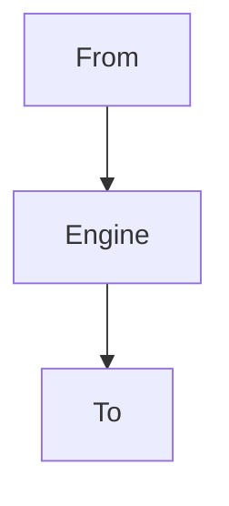

# **DViewer**

**_Dataflo is a powerful ingestion framework designed to streamline the process of moving data between different sources and destinations. With Dataflo, you can easily configure data ingestion pipelines using a simple YAML configuration file._**

## Flow-chart



## Index
- [Installation](#installation)
- [Configuration](#configuration)
- [Running](#running)
- [Web Interface](#web-interface)
- [Flow Chart](#flow-chart)


## Installation
To install Dataflo, simply run the following command:

`py -m pip install Dataflo`

## Configuration
Dataflo uses a `config.yaml` file to define the data sources, destinations, engine, and load type for your ingestion job. Here's an example of a `config.yaml` file:

#### yaml
```
job_name: test2
to:
  name: parquet
  filename: out.parquet

from: 
  name: csv
  filename: out.csv

engine:
  name: Spark

load_type: full_load
```
In this configuration:

- job_name specifies the name of your ingestion job.
- to and from specify the drivers for the destination and source respectively. Available drivers include csv, parquet, sqlserver, s3, and snowflake.
- engine specifies the processing engine to be used. Currently, only Spark is supported.
- load_type specifies the type of load, with full_load being the only option currently available.

## Running the Tool

Once you've configured your config.yaml file, you can run the ingestion job using the following command:

### code
`py -m Dataflo run`
- To perform a diagnostic check on your configuration before running the job, you can use the `--diagnose` option:


- `py -m Dataflo --diagnose run`

## Web-Interface
Dataflo also provides a web interface for monitoring and managing your ingestion jobs. To launch the web interface, use the following command:

### code
`py -m Dataflo servo`
- You can specify the port for the web interface by setting the --port option followed by the desired port number:

- `py -m Dataflo --port <port number> servo`. 

Once the web interface is running, you can access it through your web browser to view job details and monitor job status.


[Back to top](#dataflo)
